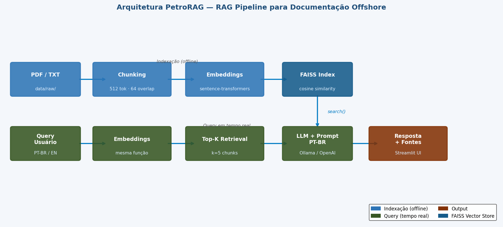
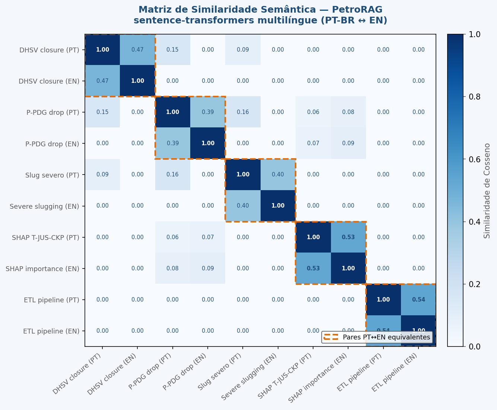
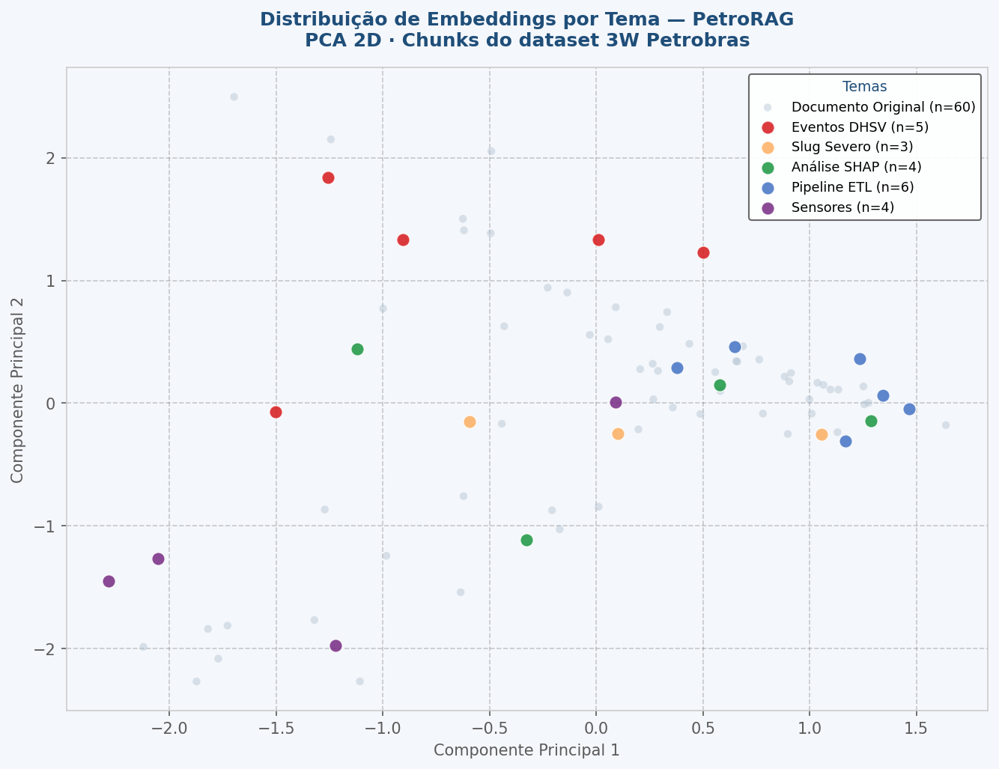

# 🛢️ PetroRAG — Busca Semântica & IA Generativa para Documentação de Poços Offshore

[](https://python.org)
[](https://langchain.com)
[](https://faiss.ai)
[](https://streamlit.io)

Sistema de **busca semântica** e **RAG (Retrieval-Augmented Generation)** aplicado à documentação técnica de poços de petróleo offshore — com foco no domínio do [Dataset 3W da Petrobras](https://github.com/petrobras/3W).

Permite fazer perguntas em linguagem natural sobre relatórios técnicos, documentação de sensores e resultados de modelos de ML, recebendo respostas geradas por IA com citação de fontes.

---

## 🎯 Motivação

Sistemas de ML aplicados a dados de poços offshore geram grande volume de documentação técnica (relatórios de sensores, análises SHAP, pipelines ETL, resultados de modelos). Encontrar informação relevante nesse volume por palavra-chave é ineficiente. **Busca semântica com embeddings** e **RAG com LLM** permitem consultas em linguagem natural com recuperação de contexto preciso.

---

## ⚙️ Stack Tecnológica

| Componente | Tecnologia |
|---|---|
| **Embeddings** | `sentence-transformers/paraphrase-multilingual-MiniLM-L12-v2` |
| **Vector Store** | FAISS (Facebook AI Similarity Search) |
| **RAG Framework** | LangChain |
| **LLM (local)** | Ollama + Llama 3.2 (sem custo, roda offline) |
| **LLM (cloud)** | OpenAI GPT-4o mini (opcional) |
| **Interface** | Streamlit |
| **Chunking** | RecursiveCharacterTextSplitter (512 tokens, 64 overlap) |

---

## 🏗️ Arquitetura



---

## 📊 Visualizações de Embeddings

### Matriz de Similaridade Semântica (PT-BR ↔ EN)

Demonstra que o modelo multilíngue reconhece termos equivalentes em português e inglês como semanticamente próximos — sem tradução explícita.



### Distribuição dos Embeddings por Tema (PCA 2D)

Visualização da separação semântica entre clusters temáticos do domínio offshore: eventos DHSV, slug severo, análise SHAP, pipeline ETL e sensores.



---

## 🚀 Como usar

### 1. Instalar dependências

```bash
pip install -r requirements.txt
```

### 2. Configurar ambiente

```bash
cp .env.example .env
# Edite o .env conforme necessário
```

**Para rodar com LLM local (gratuito):**
```bash
# Instale o Ollama: https://ollama.com/download
ollama pull llama3.2
# Certifique-se de que está rodando:
ollama serve
```

**Para usar OpenAI:**
```bash
# No .env:
LLM_PROVIDER=openai
OPENAI_API_KEY=sk-...
```

### 3. Adicionar documentos e indexar

```bash
# Coloque PDFs ou TXTs em data/raw/
cp meu_relatorio.pdf data/raw/

# Construir o índice FAISS
make index
# ou: python scripts/build_index.py
```

### 4. Rodar o app

```bash
make app
# ou: streamlit run app.py
```

### 5. Busca via CLI (sem Streamlit)

```bash
make search
# ou: python scripts/search.py "fechamento espúrio da válvula DHSV"
```

---

## 📂 Estrutura do Projeto

```
nlp-petroleo-rag/
├── app.py                  # Streamlit — 3 abas: Busca, RAG, Documentos
├── config.py               # Configurações centrais (env vars)
├── requirements.txt
├── Makefile
├── .env.example
├── .gitignore
├── data/
│   ├── raw/                # Documentos a indexar (PDF/TXT)
│   └── vectorstore/        # Índice FAISS (gerado, não versionado)
├── src/
│   ├── embeddings.py       # Carregamento do modelo HuggingFace
│   ├── indexer.py          # Pipeline: docs → chunks → FAISS
│   ├── retriever.py        # Busca semântica por similaridade de cosseno
│   ├── rag.py              # Chain RAG: retriever + LLM + prompt PT-BR
│   └── utils.py            # Logging, formatação, validação
└── scripts/
    ├── build_index.py      # CLI para indexação
    └── search.py           # CLI para busca rápida
```

---

## 🧪 Exemplo de uso

```python
from src.indexer import build_index
from src.retriever import semantic_search

vs = build_index()  # carrega índice existente ou constrói do zero

results = semantic_search(vs, "qual sensor tem maior importância SHAP?", k=3)
for r in results:
    print(f"[{r.score:.2f}] {r.content[:200]}")
```

```
[0.12] T-JUS-CKP apresenta importância global de 69,57% segundo análise SHAP...
[0.21] A inversão de importância observada na classe DHSV Closure...
[0.34] Figura 4.8 — SHAP Summary Plot: contribuição média por sensor...
```

---

## 📊 Por que FAISS + sentence-transformers?

- **sentence-transformers multilíngue**: compreende queries em PT-BR sem necessidade de tradução
- **FAISS**: busca vetorial em O(log n) sobre milhões de embeddings com baixo consumo de memória
- **Similaridade de cosseno**: captura semântica (sinônimos, paráfrases) — supera busca por palavra-chave
- **Chunking com overlap**: preserva contexto nos limites de fragmentos

---

## 🔒 Segurança

- Chaves de API sempre via variáveis de ambiente (`.env`, nunca hardcoded)
- Índice FAISS e dados brutos excluídos do git (podem conter dados sensíveis)
- LLM local via Ollama: nenhum dado enviado para nuvem por padrão

---

## 🔗 Referências

- [Dataset 3W — Petrobras](https://github.com/petrobras/3W)
- [LangChain Docs](https://docs.langchain.com)
- 